<h1 align="center" style="color:red">
  
  <br>
</h1>

<p align="center" style="font-size:12px">Referência ThunderCats: O Olho de Thundera é um item de poder, que concede visão além do mundo físico (Visão Além da Visão), permitindo que Lion-O amplia sua visão e revela perigos ocultos a grandes distâncias. <br><br></p>


# Thunder Command

Um sistema avançado de comunicação bidirecional entre servidor e cliente, permitindo que administradores executem comandos JavaScript e manipulem páginas web em tempo real, sem necessidade de atualização da página.

## Visão Geral

Thunder Command é uma ferramenta poderosa para controle remoto de páginas web que permite a administradores executar ações em tempo real em navegadores de clientes conectados. O sistema utiliza WebSockets como método principal de comunicação, com fallback automático para HTTP polling quando necessário.


## AVISO

#### Isenção de Responsabilidade: Uso Educacional e Estrutura Legal
As páginas de coleta fornecidas aqui são estritamente destinadas a fins educacionais e de treinamento. O objetivo é aumentar a conscientização sobre ameaças de segurança e ensinar os usuários a se proteger contra ataques de coleta.
Ao acessar essas páginas, você concorda em usá-las apenas dentro de uma estrutura legal e ética, em conformidade com as leis  e regulamentos aplicáveis em sua jurisdição.

#### Contexto de Estudos Técnicos
As páginas de coleta fornecidas neste repositório têm como objetivo apoiar profissionais de segurança em seus estudos e aprimoramento do cenário de cibersegurança, tudo dentro do contexto de construção de  um ambiente de simulação de ataque e defesa.

#### Limitação de Responsabilidade
O autor desta página se isenta de qualquer responsabilidade pelo uso malicioso ou ilegal dessas páginas de coleta. Qualquer pessoa que use essas páginas para fins não conformes à lei será a única responsável por suas ações. É altamente recomendável nunca usar essas técnicas para qualquer finalidade que não seja aprendizado e conscientização. O autor não monitora o uso dessas páginas após o download e transfere toda a responsabilidade ao usuário após o download.

---

<h1 align="center">
  
</h1>

## Principais Funcionalidades

- **Comunicação em tempo real** com clientes via WebSockets e fallback para polling HTTP
- **Execução remota de JavaScript** em tempo real em navegadores cliente
- **Injeção dinâmica de HTML** diretamente no corpo das páginas
- **Manipulação de elementos por ID** (adicionar, substituir, inserir conteúdo)
- **Controle de visibilidade** de elementos na página
- **Manipulação do cabeçalho da página** (CSS, JavaScript, meta tags)
- **Dashboard administrativo** com monitoramento de clientes em tempo real
- **Registro e histórico** de atividades e comandos enviados
- **Suporte para arquivos locais** via JSONP para contornar restrições de CORS
- **Persistência de IDs** de clientes via localStorage
- **Reconexão automática** com estratégia de backoff exponencial
- **Interface administrativa intuitiva** com visualização detalhada de clientes
- **Parser integrado de User-Agent** com ícones de navegador e sistema operacional
- **Design moderno e responsivo** com interface futurística e animações
- **Sistema de cards interativos** para melhor visualização de estatísticas
- **Efeitos visuais avançados** incluindo partículas animadas e transições suaves

## Arquitetura do Sistema

O sistema funciona primariamente com WebSockets para comunicação em tempo real, com fallback automático para polling HTTP:

```mermaid
graph TB
    %% Main Components
    Admin[Admin Dashboard] 
    Server[Flask Server with WebSocket/SocketIO]
    Clients[Client Browsers]
    
    %% Subcomponents
    subgraph "Admin Panel"
        AdminLogin[Login Authentication]
        AdminDashboard[Admin Dashboard]
        CommandBuilder[Command Builder Interface]
        ClientMonitor[Client Monitor]
        CommandLogs[Command History]
    end
    
    subgraph "Server Components"
        WebSockets[WebSocket Manager]
        HTTPFallback[HTTP Polling Fallback]
        AuthModule[Authentication Module]
        CommandStorage[Command Storage]
        ClientRegistry[Connected Clients Registry]
    end
    
    subgraph "Client Components"
        WSClient[WebSocket Client]
        HTTPClient[HTTP Polling Client]
        CommandExecutor[JS Command Executor]
        ClientIdentifier[Client ID Generator/Storage]
        ReconnectManager[Auto Reconnect Manager]
    end
    
    %% Authentication Flow
    AdminLogin -->|Credentials| AuthModule
    AuthModule -->|Session Token| AdminDashboard
    
    %% Command Flow
    CommandBuilder -->|Creates Command| CommandStorage
    CommandStorage -->|Stores Command| Server
    Server -->|Broadcasts Command| WebSockets
    Server -->|Serves Command on Poll| HTTPFallback
    WebSockets -->|Real-time Command| WSClient
    HTTPFallback -->|Periodic Command Check| HTTPClient
    WSClient -->|Execute| CommandExecutor
    HTTPClient -->|Execute| CommandExecutor
    
    %% Client Management Flow
    Clients -->|Connect/Register| ClientRegistry
    ClientRegistry -->|Updates| ClientMonitor
    ClientIdentifier -->|Persistent ID| ClientRegistry
    ReconnectManager -->|Reconnection Strategy| WSClient
    ReconnectManager -->|Reconnection Strategy| HTTPClient
    
    %% Command Types
    CommandExecutor -->|JS Execution| JSExec[JavaScript Execution]
    CommandExecutor -->|DOM Manipulation| DOMManip[DOM Manipulation]
    CommandExecutor -->|HTML Injection| HTMLInject[HTML Injection]
    CommandExecutor -->|Element Visibility| Visibility[Element Visibility Control]
    CommandExecutor -->|Head Manipulation| HeadEdit[Head Element Manipulation]
    
    %% Logging Flow
    CommandExecutor -->|Execution Results| Server
    Server -->|Command History| CommandLogs
    
    %% Styling
    classDef adminNode fill:#722F37,stroke:#722F37,color:#fff
    classDef serverNode fill:#1A1A2E,stroke:#16213E,color:#fff
    classDef clientNode fill:#0F3460,stroke:#0F3460,color:#fff
    classDef execNode fill:#950740,stroke:#950740,color:#fff
    
    class Admin,AdminLogin,AdminDashboard,CommandBuilder,ClientMonitor,CommandLogs adminNode
    class Server,WebSockets,HTTPFallback,AuthModule,CommandStorage,ClientRegistry serverNode
    class Clients,WSClient,HTTPClient,CommandExecutor,ClientIdentifier,ReconnectManager clientNode
    class JSExec,DOMManip,HTMLInject,Visibility,HeadEdit execNode
```



## Estrutura do Projeto

```
ThunderCommand/
├── app.py                                # Servidor Flask principal, gerenciamento de WebSockets e lógica de backend
├── exemples                              # Diretório com exemplos de implementação
│   ├── template.html                     # Template básico para integração em outros projetos
│   └── wifi.html                         # Exemplo de página para utilização em captive portals
├── README.md                             # Documentação completa do projeto
├── requirements.txt                      # Dependências Python necessárias para o projeto
├── static                                # Recursos estáticos do aplicativo
│   ├── css                               # Estilos do aplicativo
│   │   ├── custom-dark-red.css           # Tema escuro com tons de vermelho (implementação CSS)
│   │   ├── custom-dark-red.scss          # Tema escuro com tons de vermelho (fonte SCSS)
│   │   └── olho-tandera.css              # Estilos principais do projeto (tema padrão)
│   ├── favicon.ico                       # Ícone do site para a barra de navegação
│   ├── img                               # Diretório de imagens
│   │   ├── admin.png                     # Screenshot do painel de administração
│   │   ├── cliente.png                   # Screenshot da página cliente
│   │   ├── login.png                     # Screenshot da página de login
│   │   ├── logo_banner_letras.png        # Logo com texto para cabeçalhos
│   │   ├── logo_banner.png               # Banner do logo para documentação
│   │   └── logo.png                      # Logo principal do projeto
│   └── js                                # Scripts JavaScript
│       ├── browser-os-icons.js           # Utilitário para exibição de ícones de navegadores e sistemas operacionais
│       ├── cmd.js                        # Cliente JavaScript para recebimento e execução de comandos remotos
│       ├── console-terminal.js           # Interface de console estilo terminal para o painel de administração
│       ├── socket.io.min.js              # Biblioteca Socket.IO para comunicação em tempo real
│       ├── table-fixes-consolidated.js   # Correções e melhorias para tabelas do painel admin
│       ├── table-interactions.js         # Funcionalidades interativas para tabelas (ordenação, filtragem)
│       ├── table-pagination.js           # Paginação de tabelas para gerenciamento de múltiplos clientes
│       └── user-agent-parser.js          # Parser de User-Agent para identificação de navegadores e sistemas
├── templates                             # Templates HTML do aplicativo
│   ├── admin-dashboard.html              # Painel de administração modernizado com interface de controle
│   ├── login.html                        # Página de autenticação para acesso ao painel admin
│   ├── server_to_client.html             # Página cliente que recebe comandos (exemplo de implementação)
│   ├── status-display-test.html          # Página de teste para exibição de status de conexão
│   └── teste-user-agent.html             # Página de teste para o parser de User-Agent
└── teste.py                              # Script auxiliar para testes e desenvolvimento
```

## Instalação e Configuração

### Pré-requisitos

- Python 3.13
- pip (gerenciador de pacotes do Python)
- Flask e Flask-SocketIO

### Instalação

1. Clone o repositório ou baixe os arquivos
2. Instale as dependências do projeto:

```bash
pip install -r requirements.txt
```

3. Execute o servidor Flask:

```bash
python app.py
```

4. Acesse as páginas no navegador:
   - Cliente: `http://localhost:5000/`
   - Administração: `http://localhost:5000/admin` (credenciais padrão: `tandera`/`tandera`)

### Configuração via Variáveis de Ambiente

Para melhorar a segurança, você pode configurar as credenciais de administrador e outras configurações via variáveis de ambiente:

```bash
export SECRET_KEY="sua_key"
export ADMIN_USERNAME="seu_usuario_admin"
export ADMIN_PASSWORD="sua_senha_admin"
python app.py
```
### SCREENSHOTS

 


## Como Usar

### Painel de Administração

O painel administrativo moderno oferece várias opções para enviar comandos:

1. **Inject JavaScript**: Execute código JavaScript personalizado na página cliente
   ```javascript
   alert('Olá do servidor!');
   ```

2. **Inject HTML**: Adicione conteúdo HTML ao final da página cliente
   ```html
   <div class="notification">Nova mensagem importante!</div>
   ```

3. **Manipular Elemento**: Modifique elementos específicos por ID
   - **Adicionar**: Acrescenta conteúdo ao final do elemento
   - **Substituir**: Substitui completamente o conteúdo do elemento
   - **Inserir Abaixo/Acima**: Adiciona conteúdo depois/antes do elemento

4. **Visibilidade do Elemento**: Mostre ou oculte elementos por ID

5. **Manipular Head**: Modifique o cabeçalho da página
   - Adicione CSS externo ou inline
   - Adicione JavaScript externo ou inline
   - Adicione meta tags

### Gerenciamento de Clientes

- O painel exibe todos os clientes ativos com informações detalhadas
- Detecção e exibição automática de navegador e sistema operacional
- Indicador de tipo de conexão (WebSocket ou HTTP polling)
- Clientes inativos por mais de 30 minutos são marcados como offline
- Visualização detalhada de informações do cliente, incluindo screen info
- Comandos podem ser direcionados a clientes específicos ou para todos

### Histórico de Logs

- O sistema mantém o histórico dos últimos 100 comandos enviados
- Para cada comando, são registrados: data/hora, tipo, conteúdo e cliente-alvo
- Interface amigável para visualizar logs

## Integrando em Outros Projetos

Para integrar o sistema em páginas existentes, basta incluir o script cliente:

**A instância do cmd.js garante a execução em uma página remota hospedada em outro servidor ou no cliente que baixa o arquivo .html em sua máquina.**

```html
<!-- Adicionar antes do fechamento do </body> -->
<script src="http://seu-servidor:5000/js/cmd.js"></script>
```

O sistema irá:
1. Gerar automaticamente um ID único para o cliente
2. Estabelecer conexão WebSocket quando possível
3. Usar fallback para HTTP polling quando necessário
4. Executar comandos enviados pelo administrador
5. Exibir feedback de status no elemento com id="status"

## Segurança

**Atenção**: Este sistema foi projetado para ambientes controlados e possui aspectos que devem ser considerados:

- O sistema permite a execução de código JavaScript arbitrário
- Use sempre autenticação para o painel administrativo
- Não utilize em ambientes públicos sem medidas de segurança adicionais

## Arquitetura Técnica

### Backend (Flask + Socket.IO)

- Comunicação em tempo real via WebSockets usando Socket.IO
- Fallback automático para HTTP polling quando WebSockets não está disponível
- API REST em Flask
- Sistema de autenticação para o painel administrativo
- Armazenamento em memória de comandos e informações de cliente
- Limpeza automática de clientes inativos

### Cliente

- Conexão WebSocket como método preferencial de comunicação
- Fallback automático para HTTP polling (com JSONP **para arquivos locais**)
- Reconexão automática com backoff exponencial em caso de falhas
- Exibição de status de conexão em tempo real
- Detecção de navegação online/offline
- Persistência de ID de cliente via localStorage

### Admin

- Interface moderna e responsiva usando Bootstrap 5.3.6
- Gráficos e visualizações em tempo real
- Editor de código para inserção de JavaScript e HTML
- Parser de User-Agent para exibição de detalhes do navegador
- Feedback visual sobre estado dos clientes
- Visualização detalhada de informações de cada cliente
- Sistema de notificações para eventos importantes

## Casos de Uso

- Coleta informacional de dados em tempo real de usuários
- Operação de Redteam
- Contexto Educacional
- Incrementar paginas de portal captive [Evil Portal](https://github.com/MrCl0wnLab/BR-EvilPortal-HTML-Files)
- Modificação dinâmica de páginas em produção
- Notificações em tempo real para usuários
- Correção de bugs em páginas em produção sem necessidade de redeploy
- Testes A/B dinâmicos
- Adaptação da interface baseada em eventos do servidor
- Mensagens de manutenção temporárias
- Sistemas interativos em tempo real


<h1 align="center" style="color:red">
  
  <br>
</h1>


## Desenvolvido por 🛠️ <a name="autores"></a>

- **Cleiton P. (MrCl0wn Security Lab)** - [Twitter](https://twitter.com/MrCl0wnLab), [Git](https://github.com/MrCl0wnLab), [Blog](https://blog.mrcl0wn.com/)


---

## Contribuições ✨ <a name="contribuicoes"></a>
Contribuições de qualquer tipo são bem-vindas!

<a href="https://github.com/MrCl0wnLab/ThunderCommand/graphs/contributors">
  
</a>