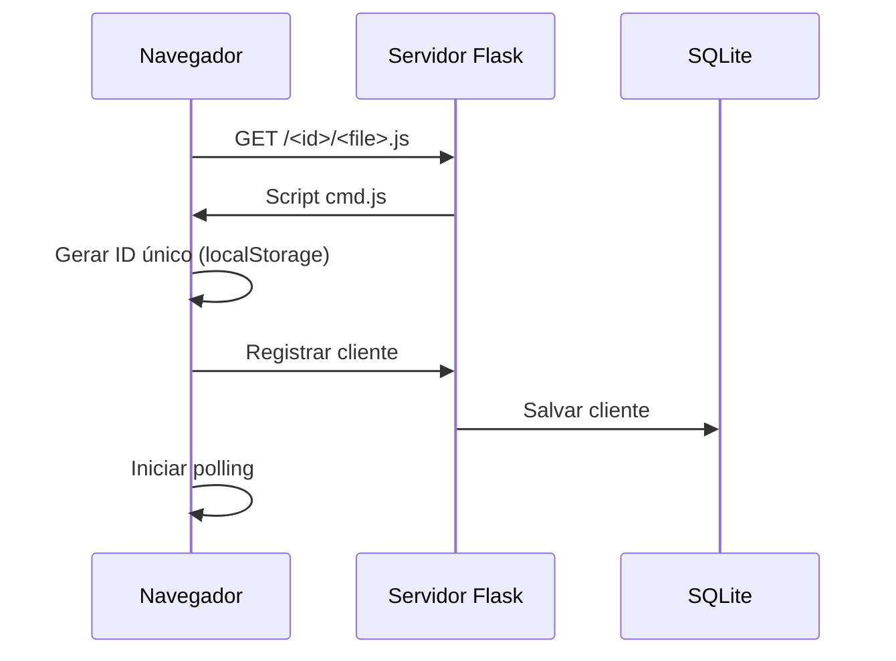
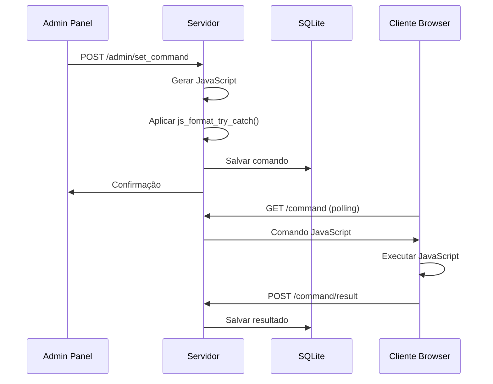

# Arquitetura Thunder Command v2.0

<h1 align="center">
  
</h1>

## Visão Geral da Arquitetura

O Thunder Command v2.0 implementa uma **arquitetura híbrida** que oferece flexibilidade entre compatibilidade legada e padrões modernos de desenvolvimento Flask.

## Padrões de Deployment

### 1. Servidor Legado (`app.py`)
- **Arquivo único** com todas as rotas e lógica de negócio
- **Compatibilidade total** com versões anteriores
- **Deploy simples** para ambientes de produção básicos
- **Ideal para**: Início rápido, testes, ambientes simples

```bash
python app.py
```

### 2. Application Factory (`run.py` + `app/`)
- **Padrão moderno Flask** com blueprints organizados
- **Separação de responsabilidades** clara
- **Configurações por ambiente** (development/production)
- **Escalabilidade** e manutenibilidade aprimoradas
- **Ideal para**: Desenvolvimento colaborativo, produção robusta

```bash
python run.py
# ou
FLASK_ENV=development python run.py
```

## Componentes Principais

### Backend - Flask + SQLite

#### Camada de Dados
- **SQLite Database**: `thunder_command.db` (auto-criado)
- **Repository Pattern**: Abstração de acesso aos dados
  - `ClientRepository`: Gerenciamento de clientes conectados
  - `CommandRepository`: Histórico e rastreamento de comandos
- **Tabelas principais**:
  - `clients`: Informações e estatísticas de clientes
  - `commands`: Histórico de comandos executados
  - `command_results`: Resultados e métricas de execução

#### Camada de Negócio
```
core/
├── database/
│   ├── connection.py         # Singleton de conexão
│   ├── client_repository.py  # CRUD de clientes
│   └── command_repository.py # CRUD de comandos
└── utils/
    ├── logger.py            # Sistema multi-nível de logs
    └── helpers.py           # Utilitários auxiliares
```

#### Camada de Aplicação (Moderna)
```
app/
├── __init__.py              # Application factory
├── api/
│   ├── admin.py            # Rotas administrativas
│   ├── client.py           # Gerenciamento de clientes
│   └── command.py          # Execução de comandos
├── auth/
│   └── routes.py           # Autenticação e autorização
├── models/
│   ├── client.py           # Modelos de dados de cliente
│   └── command.py          # Modelos de dados de comando
└── services/
    ├── client_manager.py    # Lógica de negócio de clientes
    └── command_executor.py  # Processamento de comandos
```

### Frontend - Dashboard Administrativo

#### Tecnologias
- **Bootstrap 5.3.0**: Framework CSS responsivo
- **HTMX**: Atualizações parciais sem JavaScript complexo
- **Chart.js 4.3.0**: Visualização de dados em tempo real
- **Webpack 5.88.0**: Build system moderno

#### Estrutura
```
templates/
├── base.html               # Template base
├── admin_base.html         # Base administrativa
├── admin-dashboard.html    # Dashboard principal
├── partials/               # Componentes HTMX
│   ├── card_stats.html     # Cards de estatísticas
│   ├── clients_table.html  # Tabela de clientes
│   └── form_command_table.html # Interface de comandos
└── components/             # Componentes reutilizáveis
    ├── buttons.html
    ├── command_forms.html
    └── notifications.html
```

### Cliente - Polling Inteligente

#### Características
- **HTTP Polling exclusivo**: Sem dependências WebSocket
- **Estratégias de execução inteligentes**: Detecção automática de tipos de comando
- **Tolerância a falhas**: Sistema de retry e reconexão automática
- **JSONP Support**: Compatibilidade com arquivos locais

#### Arquivos
```
payload/
├── cmd.js                  # Cliente atual (HTTP polling)
└── cmd.js.new             # Versão atualizada
```

## Fluxo de Comunicação

### 1. Inicialização do Cliente


### 2. Execução de Comandos


### 3. Processamento de Comandos HTML (Correção v2.0.1)

**Problema Original:**
```javascript
// Cliente tratava JavaScript como HTML
case 'html':
    result = this.injectHTML(commandData.command); // ❌ ERRO
```

**Correção Aplicada:**
```javascript
// Cliente executa JavaScript que injeta HTML
case 'html':
    result = await this.executeJavaScript(commandData.command); // ✅ CORRETO
```

## Sistema de Logging

### Níveis de Log
- **app_logger**: Logs gerais da aplicação
- **command_logger**: Logs específicos de comandos
- **auth_logger**: Logs de autenticação

### Estrutura
```
logs/
├── app.log              # Logs gerais
├── command.log          # Execução de comandos
└── auth.log            # Eventos de autenticação
```

## Configuração por Ambiente

### Development
```python
# config/development.py
DEBUG = True
TESTING = True
SECRET_KEY = 'dev-secret-key'
```

### Production
```python
# config/production.py
DEBUG = False
TESTING = False
SECRET_KEY = os.environ.get('SECRET_KEY')
```

## Sistema de Build Frontend

### Desenvolvimento
```bash
npm install              # Instalar dependências
npm run dev             # Modo desenvolvimento
npm run lint            # Verificar código
npm test                # Executar testes
```

### Produção
```bash
npm start               # Build de produção
npm run build           # Build otimizado
```

## Segurança e Autenticação

### Autenticação
- **Session-based**: Gerenciamento via Flask sessions
- **Credenciais padrão**: `tandera`/`tandera` (configurável via ENV)
- **Middleware**: Decorator `@login_required`

### Variáveis de Ambiente
```bash
SECRET_KEY="sua_chave_secreta"
ADMIN_USERNAME="seu_usuario"
ADMIN_PASSWORD="sua_senha"
HOST="0.0.0.0"
PORT="5000"
```

## Monitoramento e Métricas

### Captura de Resultados
- **Toggle configurável**: Habilitação/desabilitação global
- **Métricas detalhadas**: Tempo de execução, tipo de resultado
- **Contadores**: Comandos recebidos, bem-sucedidos, falhados

### Limpeza Automática
- **Clientes inativos**: Remoção após 30 minutos (configurável)
- **Logs rotacionais**: Limite de 1000 comandos (configurável)
- **Cache híbrido**: Memória + persistência para performance

## Extensibilidade

### Adicionando Novos Tipos de Comando
1. **Server-side**: Atualizar `app/services/command_executor.py` ou `app.py`
2. **Client-side**: Modificar `payload/cmd.js`
3. **UI**: Adicionar em `templates/partials/form_command_table.html`
4. **Testes**: Criar em `tests/unit/` e `tests/integration/`

### Novos Blueprints
```python
# app/api/new_feature.py
from flask import Blueprint

bp = Blueprint('new_feature', __name__)

@bp.route('/new-endpoint')
def new_endpoint():
    return {'status': 'success'}
```

```python
# app/__init__.py
from app.api import new_feature
app.register_blueprint(new_feature.bp, url_prefix='/api')
```

## Performance e Otimização

### Cache Strategy
- **Clientes ativos**: Cache em memória para polling rápido
- **Comandos**: Persistência SQLite + cache temporário
- **Resultados**: Armazenamento opcional configurável

### Polling Optimization
- **Intervalos inteligentes**: Ajuste automático baseado na atividade
- **Retry logic**: Backoff exponencial para reconexões
- **Batch processing**: Múltiplos clientes processados eficientemente

## Troubleshooting Arquitetural

### Problemas Comuns
1. **Dual server conflict**: Não execute `app.py` e `run.py` simultaneamente
2. **Port binding**: Verifique se porta 5000 está disponível
3. **Database locks**: SQLite não suporta escritas concorrentes extremas
4. **Memory leaks**: Monitore crescimento de cache de clientes

### Debugging
```bash
# Logs detalhados
FLASK_ENV=development python run.py

# Database inspection
sqlite3 thunder_command.db
.tables
SELECT * FROM clients;
```

---

Esta arquitetura oferece flexibilidade, escalabilidade e manutenibilidade, permitindo que o Thunder Command evolua conforme as necessidades do projeto.